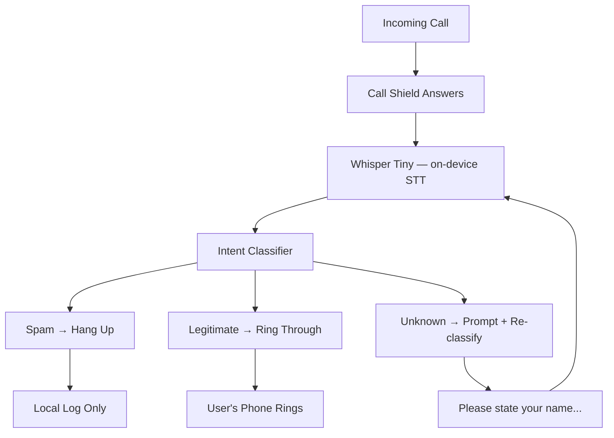

<!-- Unlicense — cochranblock.org -->

# Proof of Artifacts

*Visual and structural evidence that this project works, ships, and is real.*

> Call Shield — on-device call screening without the cloud.

## Architecture



## Build Output

| Metric | Value |
|--------|-------|
| Target binary size | ~42MB (Whisper Tiny quantized + classifier + call logic) |
| Cloud dependencies | Zero |
| Audio sent to cloud | Zero bytes, ever |
| Classification latency | <500ms on-device |
| Connectivity required | None |

## How to Verify

```bash
cargo build --release
```

---

*Part of the [CochranBlock](https://cochranblock.org) zero-cloud architecture. All source under the Unlicense.*
