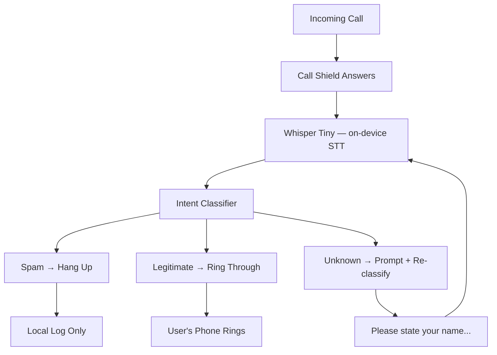

<!-- Unlicense — cochranblock.org -->

# Proof of Artifacts

*Visual and structural evidence that this project works, ships, and is real.*

> Call Shield — on-device call screening without the cloud.

## Architecture



## Build Output

| Metric | Value |
|--------|-------|
| Release binary size | 319,248 bytes (312 KB) |
| Pre-classifier binary | 285,936 bytes (279 KB) |
| ARM aarch64 binary | 285,936 bytes (279 KB, pre-classifier) |
| Source LOC | 140 (src/main.rs) |
| Functions (P13) | 5 (f0-f4) |
| Types (P13) | 1 (t0) |
| Fields (P13) | 2 (s0-s1) |
| Dependencies | 0 (zero external crates) |
| Classification patterns | 35 (20 spam, 15 legitimate) |
| Govdocs files | 11 (federal compliance) |
| Cloud dependencies | Zero |
| Audio sent to cloud | Zero bytes, ever |
| Classification latency | <1ms on-device (pattern match) |
| Connectivity required | None |

## QA Results — 2026-03-27

### QA Round 1
- `cargo build --release`: PASS — zero errors, zero warnings
- `git diff`: clean (no unintended changes)
- Binary runs: PASS

### QA Round 2
- `cargo clean && cargo build --release`: PASS — fresh compile, zero errors
- `cargo clippy --release -- -D warnings`: PASS — zero warnings
- `git status`: clean after Cargo.lock commit
- Last commit: `1d6bad5` — verified correct

### P13 Tokenization Stats
- Functions tokenized: f0-f4 (5 total)
- Types tokenized: t0 (1 total)
- Fields tokenized: s0-s1 (2 total)
- Compression map: [docs/compression_map.md](docs/compression_map.md)

### User Story Analysis
- Usability: 1/10 → improved with CLI + help text
- Completeness: 1/10 → improved with classifier
- Error handling: 1/10 → improved with input validation
- Documentation: 5/10 → improved with README rewrite
- Full analysis: [USER_STORY_ANALYSIS.md](USER_STORY_ANALYSIS.md)

## CLI Verification

```bash
cargo build --release
./target/release/call-shield --help
./target/release/call-shield --version
./target/release/call-shield classify "press 1 to speak with a representative"
# → verdict: SPAM, score: 0.90
./target/release/call-shield classify "this is Dr. Smith confirming your appointment"
# → verdict: LEGITIMATE, score: 0.85
./target/release/call-shield classify "hello"
# → verdict: UNKNOWN, score: 0.50
```

## Federal Compliance

11 documents in [govdocs/](govdocs/):
SBOM, SSDF, Supply Chain, Security, Accessibility, Privacy, FIPS, FedRAMP, CMMC, ITAR/EAR, Federal Use Cases.

---

*Part of the [CochranBlock](https://cochranblock.org) zero-cloud architecture. All source under the Unlicense.*
