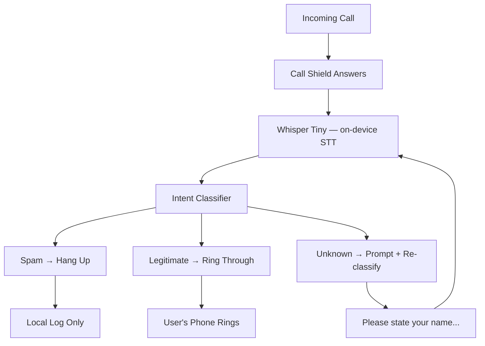

<!-- Unlicense — cochranblock.org -->

# Proof of Artifacts

*Visual and structural evidence that this project works, ships, and is real.*

> Call Shield — on-device call screening without the cloud.

## Architecture



## Build Output

| Metric | Value |
|--------|-------|
| Release binary size | 368,896 bytes (360 KB) |
| Source LOC | 474 (src/main.rs) |
| Functions (P13) | 11 (f0-f10) |
| Types (P13) | 2 (t0-t1) |
| Fields (P13) | 2 (s0-s1) |
| Dependencies | 0 (zero external crates) |
| Classification patterns | 35 (20 spam, 15 legitimate) |
| Embedded govdocs | 11 files baked into binary |
| Cloud dependencies | Zero |
| Audio sent to cloud | Zero bytes, ever |
| Classification latency | <1ms on-device |
| Connectivity required | None |

## Features

| Feature | Status |
|---------|--------|
| `classify` — single-line intent classification | Working |
| `screen` — interactive multi-turn call screening | Working |
| `govdocs` — embedded compliance docs at runtime | Working |
| `--sbom` — machine-readable SPDX 2.3 SBOM | Working |
| `--help` / `--version` | Working |
| Error handling (bad input, unknown commands) | Working |
| Whisper Tiny on-device STT | Planned |
| Real audio capture | Planned |
| Telephony integration | Planned |

## QA Results

### QA Round 1 — 2026-03-27
- `cargo build --release`: PASS
- `git diff`: clean
- Binary runs: PASS

### QA Round 2 — 2026-03-27
- `cargo clean && cargo build --release`: PASS
- `cargo clippy --release -- -D warnings`: PASS
- `git status`: clean

### P13 Tokenization Stats
- Functions: f0-f10 (11 total)
- Types: t0-t1 (2 total)
- Fields: s0-s1 (2 total)
- Compression map: [docs/compression_map.md](docs/compression_map.md)

## CLI Verification

```bash
cargo build --release

# Classify
./target/release/call-shield classify "press 1 to speak with a representative"
# → verdict: SPAM, score: 0.90, matched: press 1

# Interactive screening
./target/release/call-shield screen
# → Multi-turn conversation with real-time classification

# Embedded compliance docs
./target/release/call-shield govdocs sbom

# Machine-readable SBOM for federal scanners
./target/release/call-shield --sbom > sbom.spdx
```

## Federal Compliance

11 documents in [govdocs/](govdocs/), also embedded in the binary:
SBOM, SSDF, Supply Chain, Security, Accessibility, Privacy, FIPS, FedRAMP, CMMC, ITAR/EAR, Federal Use Cases.

---

*Part of the [CochranBlock](https://cochranblock.org) zero-cloud architecture. All source under the Unlicense.*
