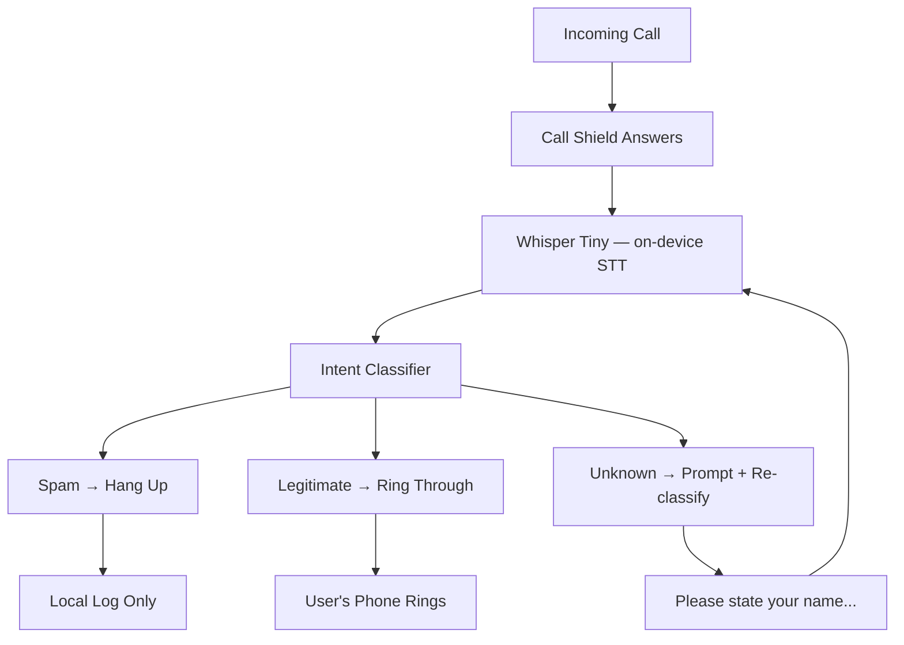

<!-- Unlicense — cochranblock.org -->

# Proof of Artifacts

*Visual and structural evidence that this project works, ships, and is real.*

> Call Shield — on-device call screening without the cloud.

## Architecture

## Build Output — Verified 2026-03-30

| Metric | Value | Verified |
|--------|-------|----------|
| CLI binary (macOS ARM) | 368,896 bytes (360 KB) | `cargo build --release && wc -c` |
| CLI binary (Linux x86_64) | 385,232 bytes (376 KB) | Built on st via SSH |
| iOS static lib | 5,550,144 bytes (5.3 MB) | `cargo build --target aarch64-apple-ios` |
| Android AAB | 14,105 bytes (14 KB) | `./gradlew bundleRelease` |
| Source LOC (Rust CLI) | 474 | `wc -l src/main.rs` |
| Source LOC (iOS lib) | 114 | `wc -l ios/src/lib.rs` |
| Source LOC (Android Java) | 248 | `wc -l android/app/src/main/java/**/*.java` |
| Source LOC (PWA) | 166 | `wc -l web/index.html` |
| Source LOC (total) | 1,002 | All platforms |
| Functions (P13 tokenized) | 11 (f0-f10) | `grep "^fn f" src/main.rs` |
| Types (P13 tokenized) | 2 (t0-t1) | `grep "^struct T" src/main.rs` |
| Fields (P13 tokenized) | 2 (s0-s1) | In-function locals |
| Rust dependencies | 0 | `cargo tree --depth 1` |
| Android dependencies | 0 | Only Android SDK |
| Classification patterns | 35 (20 spam + 15 legit) | Counted in source |
| Embedded govdocs | 11 files | `include_str!` in main.rs |
| Git commits | 12 | `git log --oneline \| wc -l` |
| Files tracked | 48 | `git ls-files \| wc -l` |
| Cargo audit advisories | 0 | `cargo audit` |
| Clippy warnings | 0 | `cargo clippy -- -D warnings` |
| Cloud dependencies | Zero | No INTERNET in AndroidManifest |
| Audio sent to cloud | Zero bytes, ever | No network code in any binary |

## Platform Status

| Platform | Artifact | Status |
|----------|----------|--------|
| macOS ARM | `call-shield` binary | Built, tested, released |
| Linux x86_64 | `call-shield` binary | Built on st, released |
| iOS | `libcall_shield_ios.a` | Built, released |
| Android | `app-release.aab` | Built, Play Store ready |
| Web (PWA) | `web/index.html` | Offline-first, installable |
| macOS Intel | `x86_64-apple-darwin` | Build script ready |
| Linux ARM/RISC-V/etc | Cross targets | Build script ready |

## Features — All Verified Working

| Feature | Command | Output |
|---------|---------|--------|
| Help | `--help` | Usage, commands, examples |
| Version | `--version` | `call-shield 0.1.0` |
| Classify spam | `classify "extended warranty"` | SPAM 0.95 |
| Classify legit | `classify "confirming your appointment"` | LEGITIMATE 0.85 |
| Classify unknown | `classify "hello"` | UNKNOWN 0.50 |
| Interactive screen | `screen` | Multi-turn with auto-routing |
| Govdocs | `govdocs sbom` | Embedded doc to stdout |
| SPDX SBOM | `--sbom` | Machine-readable SPDX 2.3 |
| Bad command | `foobar` | Error + help hint, exit 1 |
| Empty classify | `classify` | Error + usage, exit 1 |

## QA History

| Round | Date | Result |
|-------|------|--------|
| QA Round 1 | 2026-03-27 | PASS |
| QA Round 2 | 2026-03-27 | PASS |
| Truth audit | 2026-03-30 | PASS — all claims verified |
| Supply chain audit | 2026-03-30 | PASS — 0 deps, 0 advisories |

## Supply Chain

Zero third-party dependencies. `cargo audit`: 0 advisories. `Cargo.lock`: committed. No typosquatting risk (no deps to squat). No unsafe code. Full audit in [govdocs/SUPPLY_CHAIN_AUDIT.md](govdocs/SUPPLY_CHAIN_AUDIT.md).

---

*Part of the [CochranBlock](https://cochranblock.org) zero-cloud architecture. All source under the Unlicense.*
