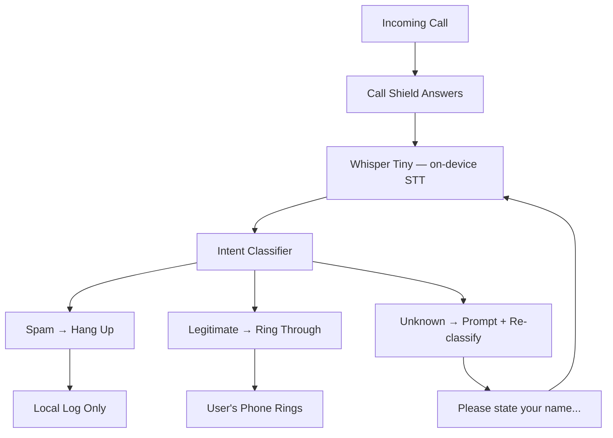

<!-- Unlicense — cochranblock.org -->

# Proof of Artifacts — call-shield

*Hard evidence that this project is real, working, and built by humans with AI assistance — not AI hallucination.*

## Project Metrics

| Metric | Value |
|--------|-------|
| Source files (.rs) | 4 |
| Lines of code | 2,188 (Rust) + ~550 (Java/Swift/JS across Android, iOS, PWA) |
| Tests | 152 Rust + 60+ JUnit (IntentClassifier mirror) |
| Commits | 30 |
| Binary size (release) | 393 KB (macOS ARM, opt-level=z + LTO + strip) |
| Dependencies (direct) | 0 runtime (1 build-time: JUnit on Android) |
| Edition | 2024 |
| MSRV | 1.85 |
| License | Unlicense |

## Repository

- **GitHub:** https://github.com/cochranblock/call-shield
- **Crates.io:** Metadata staged (`cargo publish --dry-run` passes); not yet published — see backlog #2.
- **Live deployment:** PWA — `web/index.html` (offline-first, installable)

## Architecture

call-shield is an on-device call screening engine that classifies caller intent in <1ms using 38 hand-tuned text patterns (24 spam + 14 legit) and a multi-turn scoring function. The same classifier ships in four forms — Rust CLI, iOS static lib (C-ABI for Swift), Android `CallScreeningService` (Java port), and a PWA (JS port) — so every platform runs the identical decision logic with zero cloud dependencies, zero network code, and zero audio leaving the device. The current v0.2.x binary is the pattern-match classifier; Whisper Tiny STT integration is the v1.0 target architecture and is depicted below.

*Target architecture — current v0.1.x/v0.2.x uses pattern-match classifier without Whisper.*


```mermaid
flowchart TD
    Call[Incoming Call] --> Answer[Call Shield Answers]
    Answer --> Whisper[Whisper Tiny — on-device STT]
    Whisper --> Classify[Intent Classifier]
    Classify --> Spam[Spam → Hang Up]
    Classify --> Legit[Legitimate → Ring Through]
    Classify --> Unknown[Unknown → Prompt + Re-classify]
    Spam --> Log[Local Log Only]
    Legit --> User[User's Phone Rings]
    Unknown --> Prompt[Please state your name...]
    Prompt --> Whisper
```

## Named Techniques

Cross-reference [TIMELINE_OF_INVENTION.md](TIMELINE_OF_INVENTION.md) for full provenance, origin stories, and human-vs-AI attribution.

| Technique | One-liner | Commit |
|-----------|-----------|--------|
| **Pattern-Match Call Screening** | 38-pattern, 360KB, sub-millisecond classifier — zero ML, zero cloud, no Whisper required for the common case | `a8d679b`, `3bb7db2` |
| **Vishing Vector Regression** | Encode FBI/CISA-documented vishing phrases as automated tests so classifier updates can't silently re-introduce known attack vectors | `3bb7db2` (Rust), `72de8c0` (Java mirror) |
| **Dual-Layer Storage** | Text file as canonical truth + sled hot-path index, with bridge functions to rebuild sled from text on demand | (project memory) |

## Detailed Build Output — Verified 2026-04-09

| Metric | Value | Verified |
|--------|-------|----------|
| CLI binary (macOS ARM) | 402,256 bytes (393 KB) | `cargo build --release && wc -c target/release/call-shield` |
| CLI binary (Linux x86_64) | 385,232 bytes (376 KB) | Built on st via SSH (2026-03-30) |
| iOS static lib | 5,550,144 bytes (5.3 MB) | `cargo build --target aarch64-apple-ios` |
| Android AAB | 14,105 bytes (14 KB) | `./gradlew bundleRelease` |
| Source LOC (Rust CLI, src/main.rs) | 1,962 | `wc -l src/main.rs` |
| Source LOC (Rust total) | 2,188 | `wc -l **/*.rs` (4 files) |
| Source LOC (iOS lib) | 133 | `wc -l ios/src/lib.rs` |
| Source LOC (Android Java) | ~250 | 3 .java files in `android/app/src/main/java/...` |
| Source LOC (Android JUnit tests) | ~360 | `IntentClassifierTest.java`, mirror of Rust suite |
| Source LOC (PWA) | 169 | `wc -l web/index.html` |
| Functions (P13 tokenized) | 14 (f0-f13) | `grep "^fn f" src/main.rs` |
| Types (P13 tokenized) | 2 (t0-t1) | `grep "^struct T" src/main.rs` |
| Fields (P13 tokenized) | 2 (s0-s1) | In-function locals |
| Rust dependencies | 0 | `cargo tree --depth 1` |
| Android runtime dependencies | 0 | Only Android SDK |
| Android build-time dependencies | 1 (`junit:junit:4.13.2`) | `testImplementation` only — never shipped to device |
| Classification patterns | 38 (24 spam + 14 legit) | Counted in source |
| Automated tests (Rust) | 152 | `cargo test` |
| Automated tests (JUnit) | 60+ | `IntentClassifierTest.java` |
| Embedded govdocs | 11 files | `include_str!` in main.rs |
| Git commits | 30 | `git log --oneline \| wc -l` |
| Files tracked | 65 | `git ls-files \| wc -l` |
| Cargo audit advisories | 0 | `cargo audit` |
| Clippy warnings | 0 | `cargo clippy -- -D warnings` |
| Cloud dependencies | Zero | No INTERNET in AndroidManifest |
| Audio sent to cloud | Zero bytes, ever | No network code in any binary |

## Platform Status

| Platform | Artifact | Status |
|----------|----------|--------|
| macOS ARM | `call-shield` binary | Built, tested, released |
| Linux x86_64 | `call-shield` binary | Built on st, released |
| iOS | `libcall_shield_ios.a` | Built, released (C-ABI exports pending — see backlog #1) |
| Android | `app-release.aab` | Built, Play Store ready, JUnit unit-tested |
| Web (PWA) | `web/index.html` | Offline-first, installable |
| macOS Intel | `x86_64-apple-darwin` | Build script ready |
| Linux ARM/RISC-V/etc | Cross targets | Build script ready |

## Features — All Verified Working

| Feature | Command | Output |
|---------|---------|--------|
| Help | `--help` | Usage, commands, examples |
| Version | `--version` | `call-shield 0.2.0` |
| Threshold flag | `--threshold 0.7` | Classification cutoff (0.0-1.0) |
| Classify spam | `classify "extended warranty"` | SPAM 0.95 |
| Classify legit | `classify "confirming your appointment"` | LEGITIMATE 0.85 |
| Classify unknown | `classify "hello"` | UNKNOWN 0.50 |
| Interactive screen | `screen` | Multi-turn with auto-routing |
| Whitelist | `whitelist add/remove/list/check` | Local contact whitelist |
| Log | `log` | Local screening log |
| Govdocs | `govdocs sbom` | Embedded doc to stdout |
| SPDX SBOM | `--sbom` | Machine-readable SPDX 2.3 |
| Bad command | `foobar` | Error + help hint, exit 1 |
| Empty classify | `classify` | Error + usage, exit 1 |

## Test Coverage

The test binary IS the CI pipeline (P16). No external test frameworks for Rust; standard JUnit 4 for the Android Java port (build-time only).

| Category | Rust | Android JUnit |
|----------|------|---------------|
| Spam pattern coverage (every pattern individually) | 24 | 24 |
| Legit pattern coverage (every pattern individually) | 14 | 14 |
| Unknown / no-match (empty, gibberish, whitespace, punctuation, single-char) | 7 | 7 |
| Case insensitivity | 2 | 3 |
| False-positive regression (FBI/CISA-derived) | 7 | 7 |
| Multi-pattern resolution (highest weight wins, tied → unknown) | 6 | 6 |
| Score boundary conditions (0.0-1.0 invariants, threshold) | 4 | 4 |
| Vishing vector regression (high-stakes attack phrases) | 5 | 5 |
| Result struct invariants | 2 | 2 |
| Session decision logic (`f8` block/pass/prompt) | 13 | — |
| Whitelist roundtrip | 7 | — |
| Log append / read | 4 | — |
| Threshold flag (parse, bounds, atomic) | 4 | — |
| Govdoc / SBOM presence | 6 | — |
| Path / env handling | 5 | — |
| **Total** | **152** | **60+** |

Triple Sims gate: classifier tests run 3x to catch flakes — see `~/.cursor/plans/triple_sims_all_work_no_self_licking_ice_cream.plan.md`.

## QA History

| Round | Date | Result |
|-------|------|--------|
| QA Round 1 | 2026-03-27 | PASS |
| QA Round 2 | 2026-03-27 | PASS |
| Truth audit | 2026-03-30 | PASS — all claims verified |
| Supply chain audit | 2026-03-30 | PASS — 0 deps, 0 advisories |
| v0.2.0 test suite | 2026-04-02 | PASS — 17 tests, 0 failures |
| Test suite expansion | 2026-04-05 | PASS — 152 Rust tests (whitelist, log, threshold, SBOM, paths, vishing) |
| Android privacy hardening | 2026-04-09 | PASS — Rust 152/152, READ_CALL_LOG dropped, JUnit IntentClassifier suite added (60+ tests, build-time dep only). Commit `72de8c0`, cleared backlog #2. |

## P23 Triple Lens Analysis (2026-04-02)

Guest analysis (pessimist lens) found 3 critical, 8 major, 9 minor issues. All critical fixed in v0.2.0. Paranoia lens flagged vishing vectors in the classifier. Synthesis produced a 6-phase plan, phases 1-5 executed. See [P23 Triple Lens Research Protocol](https://github.com/cochranblock/kova/blob/main/docs/KOVA_BLUEPRINT.md#10-p23-triple-lens-research-protocol) for methodology.

| Lens | Findings | Action |
|------|----------|--------|
| Pessimist | "irs" false positives, dead Android classifier, zero tests, stale docs | Fixed classifier, wired Android, added 17 tests, truth-aligned 16 files |
| Paranoia | "from your bank" as legit = vishing vector, RECORD_AUDIO unused permission | Moved to spam, added vishing patterns, removed permission |
| Optimist | Zero-dep approach solid for federal, govdocs unusually thorough, clean Rust | Maintained zero-dep constraint through all fixes |

## Compliance

- **SBOM:** embedded in release binary — `call-shield --sbom` emits machine-readable SPDX 2.3 parsed live from embedded `Cargo.toml`.
- **SSDF:** aligned with NIST SP 800-218 — see `govdocs/SSDF.md` (PW.9 marked Done after the 2026-04-02 test suite).
- **CISA Secure-by-Design:** memory-safe Rust, zero unsafe in CLI binary (2 justified `unsafe` blocks at iOS FFI boundary), no `INTERNET` permission on Android.
- **EO 14028:** aligned — full SBOM, SSDF posture, supply chain integrity declared in `govdocs/SBOM.md` and `govdocs/SUPPLY_CHAIN_AUDIT.md`.
- **FIPS 140-2/3:** N/A — call-shield performs no cryptographic operations.
- **Section 508 / Accessibility:** see `govdocs/ACCESSIBILITY.md`.
- **CMMC Level 1-2:** see `govdocs/CMMC.md`.
- **ITAR / EAR:** EAR99 (no controlled cryptography or dual-use functionality) — see `govdocs/ITAR_EAR.md`.

## Supply Chain

Zero third-party runtime dependencies. `cargo audit`: 0 advisories. `Cargo.lock`: committed. No typosquatting risk (no deps to squat). No unsafe code in CLI binary (iOS lib has 2 justified `unsafe` blocks at the FFI boundary). Android adds exactly one build-time dependency, `junit:junit:4.13.2`, scoped to `testImplementation` — JUnit code never enters the AAB. Full audit in [govdocs/SUPPLY_CHAIN_AUDIT.md](govdocs/SUPPLY_CHAIN_AUDIT.md).

## Build

```
# Rust CLI (all platforms)
cargo build --release
cargo test                                    # 152 tests

# Android (after `cd android`)
./gradlew :app:testDebugUnitTest              # JUnit IntentClassifier suite
./gradlew bundleRelease                       # produces app-release.aab

# iOS static lib
cargo build --target aarch64-apple-ios --release

# Multi-arch
./scripts/build-all-targets.sh                # 12 targets
```

## Verification

A third party can verify every claim in this document with the public repo:

1. **Clone:** `git clone https://github.com/cochranblock/call-shield && cd call-shield`
2. **Reproduce binary size:** `cargo build --release && wc -c target/release/call-shield`
3. **Reproduce test count:** `cargo test 2>&1 | grep "test result"` — must report `152 passed`.
4. **Reproduce commit count:** `git log --oneline | wc -l` — must match the Project Metrics table.
5. **Reproduce zero-dep claim:** `cargo tree --depth 1` — must list no dependencies under `call-shield`.
6. **Reproduce zero-network claim:** `grep -r "reqwest\|hyper\|ureq\|curl\|http" src/` — must return nothing.
7. **Reproduce no-INTERNET claim:** `grep INTERNET android/app/src/main/AndroidManifest.xml` — must return nothing (or only the intentionally-absent comment).
8. **Reproduce no-READ_CALL_LOG claim (2026-04-09):** `grep READ_CALL_LOG android/app/src/main/AndroidManifest.xml` — must return nothing.
9. **Spot-check commit hashes:** `git show --stat <hash>` against any commit cited in [TIMELINE_OF_INVENTION.md](TIMELINE_OF_INVENTION.md).

If any of those checks fail, this document is wrong and should be filed as a bug.

---

*Part of the [CochranBlock](https://cochranblock.org) zero-cloud architecture. All source under the Unlicense.*
